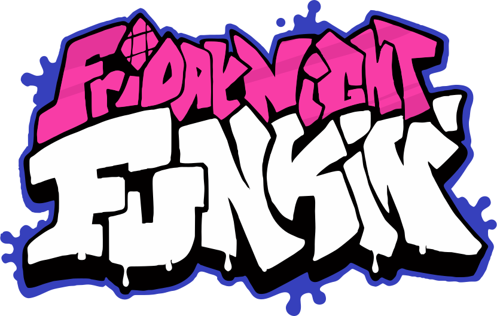

<!--lint ignore double-link-->
# Friday Night Funkin' Resources 

  

> Various community curated resources for the game Friday Night Funkin'.

**[Friday Night Funkin'](https://www.newgrounds.com/portal/view/770371)** (FNF) is a cartoon rhythm game developed for the Ludem Dare 47 game jam, and first uploaded to Newgrounds in October 2020. FNF boasts a classic Flash game artstyle, original music, and a thriving modding community.

Check out **[the official Funkin' Blog](https://funkin.me/blog/)**

Contributions are welcome! Add links through pull requests or create an issue to start a discussion.

Unsure what to contribute? Check out the `good first issue` [tagged GitHub issues](https://github.com/FunkinCrew/funkin-resources/issues?q=is%3Aissue+is%3Aopen+label%3A%22good+first+issue%22) and read our !

<!-- 
  HTML is valid in GitHub markdown.
  Thus, HTML comments are visible when writing but invisible on the rendered document. Sneaky!
-->

## Contents

<!--
  Ensure this table of contents is updated as sections are added.
  Do not include the Footnotes section.
-->

- [Animation](#animation)
  - [Spritesheet Generation](#spritesheet-generation)
- [Composing](#composing)
  - [Free Software for Making Music](#free-software-for-making-music)
  - [Chromatic Scale Guides](#chromatic-scale-guides)
- [Programming](#programming)
  - [Engines and Forks](#engines-and-forks)
  - [Rewrites and Ports](#rewrites-and-ports)
  - [Visual Studio Code](#visual-studio-code)
  - [Haxe/HaxeFlixel Resources](#haxehaxeflixel-resources)
- [Art](#art)
- [Charting](#charting)
- [Modding](#modding)
  - [Modding Tutorials](#modding-tutorials)

## Animation

- [Phantom Arcade Teaching Animation](https://youtu.be/bLqTpYNZ1C4) - YouTube VOD of PhantomArcade, Funkin' Crew lead, teaching his ways of Flash animation.
- [Frames to Symbol Flash Plugin](https://mega.nz/file/2fx1waBD#YJT5ooKfZ4-wjibIEhglRcxsq7QM6f_zx9JjcXLcVx0)
- [Base Game FLAs](https://github.com/FunkinCrew/Funkin/tree/master/art/flashFiles) - FLAs for Friday Night' Funkin from the GitHub repository.
- [Week 7 Update FLAs](https://twitter.com/PhantomArcade3K/status/1521540912421257218) - FLAs for the Week 7 update including the stage, Tankman and cutscenes.
- [The ULTIMATE Guide to ADOBE ANIMATE CC! (AKA Flash) - Tutorial](https://youtu.be/3iXSQ8VcPcU) - 6 year old Animate/Flash tutorial by [Jazza](https://www.youtube.com/@Jazza), has extra links in the description for more tutorials for each section. (pretty long too, yeesh, 2 hours almost!)
- [How to make 3D Friday Night Funkin Sprites (USING BLENDER)](https://youtu.be/fAuD_54Euq0) - A guide by Stupid Waluigi.
- [Aseprite](https://www.aseprite.org/) - Animated sprite editor and pixel art tool.
  - [Aseprite JSON to XML](https://github.com/MaybeMaru/Aseprite-JSON-to-XML) - Converter from Aseprite's JSON format to Sparrow XML that is compatible with Funkin'.

### Spritesheet Generation

- [FNF Spritesheet and XML Maker](https://github.com/UncertainProd/FnF-Spritesheet-and-XML-Maker) - Combines individual frames together into spritesheets for FNF, and helps you manage animations.
- [Free Texture Packer](http://free-tex-packer.com/) - Combines individual frames together into spritesheets. Has options to remove duplicate frames and rearrange frames to minimize texture size. Make sure to select `Starling` as the output format.
- [Free Online Spritesheet Maker](https://www.leshylabs.com/apps/sstool/) - Combines multiple images together into a spritesheet, an alternative to Free Texture Packer. Make sure to select `XML` as the output format.
- [oxipng](https://github.com/shssoichiro/oxipng) - Simple program for general image optimization but also works nicely with FNF Sprite Sheets.
- [compresspng](https://compresspng.com/) - Website for general image optimization, compresses a little more than oxipng.
- [Sparrow Atlas Resizer](https://github.com/KadeDev/SparrowAtlasResizer) - Simple program for resizing sparrow atlas PNG and XML files.

## Composing

- [Stems & Chromatic Scales](https://drive.google.com/drive/folders/1XndrqjB48K3HTj0V3l0HSUGtCttRfiH9) - Officially released stems of Friday Night Funkin' music by Kawaisprite.
- [How to Mimic Boyfriend's Voice](https://youtu.be/YOrC9uQiK00)
- [Writing Vocal Duets - LongestSoloEver](https://youtu.be/nDPpO4fLiAM) - A beginner-friendly guide to writing duets in a Friday Night Funkin' song.
- [6 Reasons your FNF Music Sucks - LongestSoloEver](https://youtu.be/kela6mWtIlU) - Common mistakes when writing songs for FNF. Also a bit of hyperbole along the way.
- [FNF Music Tutorial Playlist - LongestSoloEver](https://www.youtube.com/playlist?list=PLfb6KneL63QsQ58tj-RkDCHRmheAofPJj) - A playlist with all of LongestSoloEver's guides to writing FNF music (except the 2 listed above for some reason).
- [Saruky's Google Doc that includes various plugins, VSTs and other FL Studio stuff that she uses](https://docs.google.com/document/d/1wva21t4HHb8nIK71KqAXQxHTl9IXU-dEH8g249SdHWo/edit) - You can find Saruky [here](https://twitter.com/Saruky__).

### Free Software for Making Music

- [LMMS](https://lmms.io/) - A free and open source DAW that's community-driven and has plenty of built-in synths. Available for Windows, macOS, and Linux.
- [SoundBridge](https://soundbridge.io/) - A free DAW in open BETA that's intended for simplicity. Available for Windows and macOS.
- [Waveform Free](https://www.tracktion.com/products/waveform-free) - The free version of Waveform Pro that has plenty of features for music creation. Available for Windows, macOS, and Linux (Ubuntu).
- [Cakewalk by Bandlab](https://www.bandlab.com/products/cakewalk) - Formerly Cakewalk Sonar, this DAW was purchased by Bandlab and became free to the public. Available for Windows only.
- [Caustic 3](https://singlecellsoftware.com/caustic) - Simple tool inspired by rack-mount synthesizers, somewhat limited features but easy to grasp. Intended for mobile but free version is available for Windows and macOS.

### Chromatic Scale Guides
- [How to MAKE CHROMATICS (Friday Night Funkin) - bbpanzu](https://youtu.be/a7SGu1fNthc)
- [EASY FNF chromatic guide! (Friday Night Funkin') - StickyBM](https://youtu.be/PlSh_LJwQD0)
- [Shitty chromatic tutorial - ChimmieMpeg](https://www.youtube.com/watch?v=mKsU_LiHMmw) (tutorial isnt actually shit)
- [How to make FNF Chromatics in Ableton - LongestSoloEver](https://www.youtube.com/watch?v=QCA6-N-pW_0)
- [Polyphone SoundFont Editor](https://www.polyphone-soundfonts.com/) - A soundfont editor for those who want to make music quickly using their pitched samples.
- [MELODYNE FNF CHROMATIC SCALE TUTORIAL - Emihead](https://youtu.be/MSAmOhJVRLw)
- [How I make My FNF Chromatics | 1000 Sub Special PT 1 - Agentsecret24](https://youtu.be/-Jq8cilS6No)
  - Makes it so that the pitch of the chromatic and the sample work independently of each other.
- [Chromatic scale tutorial gone wrong | How I make my chromatic scales - Milk](https://youtu.be/watch?v=VmkFOPAcKbg) (basically how to make chromatics in GarageBand)
- [shitty ass chrom tutorial because i hit 400 subs - VinceS](https://youtu.be/D4jWnvAEkhk) - Makes the volumes of each sample the same (or close to the same).
- [sampling shit for your fnf chromatics tutorial - VinceS](https://youtu.be/JzKr6xFAWMA) - Shows how to sample videos to make chromatic scales of different characters. (Also works with Melodyne)
- [Zero's Chromatic Scale Tutorial](https://youtu.be/tDxsPa-21PQ&t) 
  - Shows useful shortcuts in Fl Studio for making chromatics easier.
- [how to make soundfonts for fnf using chromatic scales - HowToAvenge101](https://youtu.be/QmcU9Bh6jUQ)
- [Chromatic Scale Generator](https://gamebanana.com/tools/8906) - A tool that turns samples into a full chromatic scale.

- [How to MAKE CHROMATICS (Friday Night Funkin) - bbpanzu](https://youtu.be/a7SGu1fNthc)
- [EASY FNF chromatic guide! (Friday Night Funkin') - StickyBM](https://youtu.be/PlSh_LJwQD0)
- [Shitty chromatic tutorial - ChimmieMpeg](https://www.youtube.com/watch?v=mKsU_LiHMmw) (tutorial isnt actually shit)
- [How to make FNF Chromatics in Ableton - LongestSoloEver](https://www.youtube.com/watch?v=QCA6-N-pW_0)
- [MELODYNE FNF CHROMATIC SCALE TUTORIAL - Emihead](https://youtu.be/MSAmOhJVRLw)
- [How I make My FNF Chromatics | 1000 Sub Special PT 1 - Agentsecret24](https://youtu.be/-Jq8cilS6No)
  - Makes it so that the pitch of the chromatic and the sample work independently of each other.
- [Chromatic scale tutorial gone wrong | How I make my chromatic scales - Milk](https://youtu.be/watch?v=VmkFOPAcKbg) (basically how to make chromatics in GarageBand)
- [shitty ass chrom tutorial because i hit 400 subs - VinceS](https://youtu.be/D4jWnvAEkhk) - Makes the volumes of each sample the same (or close to the same).
- [sampling shit for your fnf chromatics tutorial - VinceS](https://youtu.be/JzKr6xFAWMA) - Shows how to sample videos to make chromatic scales of different characters. (Also works with Melodyne)
- [Zero's Chromatic Scale Tutorial](https://youtu.be/tDxsPa-21PQ&t)
  - Shows useful shortcuts in Fl Studio for making chromatics easier.
- [how to make soundfonts for fnf using chromatic scales - HowToAvenge101](https://youtu.be/QmcU9Bh6jUQ)

## Programming

- [Friday Night Funkin' Official Source Code](https://github.com/FunkinCrew/funkin) - The original open source game by The Funkin' Crew. Last updated for Week 7.

### Engines and Forks

<!--
  This section is for repositories which rewrite large parts of the game, to improve functionality, user experience, or modding capabilities.
  All entries here must be written in HaxeFlixel, otherwise the Rewrites and Ports section is more appropriate.
  Do not include links for deprecated or
-->

<!-- Disabled linting here because linting doesn't allow items with no links. -->
<!--lint ignore awesome-list-item-->
- [Psych Engine](https://github.com/ShadowMario/FNF-PsychEngine) - A fork of base game which includes new quality-of-life changes, performance improvements, and Lua-based mod tools. Popular and well-documented.
  - [Psych Engine Docs](https://github.com/ShadowMario/FNF-PsychEngine/wiki) - Psych Engine modding documentation.
  - [Alternative wiki for Psych Engine](https://github.com/CaptainBaldi/PsychRewrittenWiki/wiki) - Made by [CaptainBaldi](https://github.com/CaptainBaldi) and contributors.
  - [Another alternative wiki for Psych Engine](https://github.com/Meme1079/PsychWiki/wiki) - Made by [Meme1079](https://github.com/Meme1079) and contributors.
  - [Funkin Cocoa](https://github.com/TheWorldMachinima/FunkinCocoa) - A rewrite of base game (Psych 0.4). Aims to be as customizable as possible. Supports advanced HScript scripting using [SScript](https://github.com/TheWorldMachinima/SScript).
- *Kade Engine* - An archived engine that includes new features and quality of life fixes, targeted at pro rhythm game players.
  - [BoloVEVO's Kade Engine](https://github.com/BoloVEVO/Kade-Engine-Public) - A fork of Kade Engine that fixes all the bugs and includes new content.
    - [BoloVEVO's Kade Engine Docs](https://github.com/BoloVEVO/Kade-Engine-Public/wiki) - Kade Engine Fork modding documentation.
  - [Edak Engine](https://github.com/Skullbite/Edak-Engine) - A fork of Kade Engine with HScript support, softcoding, a cleaner file system, configurable weeks and more. It also comes with B-Side Remixes Legacy's assets.
    - [Edak Engine Docs](https://github.com/Skullbite/Edak-Engine/wiki) - Edak Engine modding documentation.
- *Forever Engine* - An archived rewrite of the game, originally written by Yoshubs. Includes performance reworks, HScript support, and more.
  - [Forever Engine Feather](https://github.com/Pluma-Team/Forever-Engine-Feather) - A fork of Forever Engine that includes all of its features, a scripting system based on HScript, called SScript, reorganized codebase, an events system based off of Hypno's Lullaby v2 and fully softcoded weeks and characters.
- [Codename Engine](https://github.com/YoshiCrafter29/CodenameEngine) - A fork of base game that provides full HScript support for advanced softcoding, along with sorted and half rewritten source for optimisation and ease of use.
  - [Codename Engine Docs](https://github.com/YoshiCrafter29/CodenameEngine/wiki) - Codename Engine modding documenation.
- [Andromeda Engine Legacy](https://github.com/nebulazorua/andromeda-engine-legacy) - Fork of Funkin' with customization and gameplay in mind.
  - [Andromeda Engine Docs](https://github.com/nebulazorua/andromeda-engine-legacy/wiki) - Andromeda Engine (LEGACY) Modchart API documentation.
  - [Andromeda 2.0](https://github.com/nebulazorua/andromeda-2.0) - **NOTE: Andromeda 2.0 is in HEAVY development and is in a very early alpha stage**.
- [FPS Plus](https://github.com/ThatRozebudDude/FPS-Plus-Public) - A fork of Funkin', as the name suggests, with higher framerate, better input system, rebindable keys and more. [B-Side Redux](https://gamebanana.com/mods/42724) was made on this engine.
- [Super Engine](https://github.com/superpowers04/Super-Engine) - A fork of Kade Engine that features revamped menus, mod support and online functionality.

- [Leather Engine](https://github.com/Leather128/LeatherEngine) - An engine that includes 1-21 key support, supports mod loading with Polymod and has other useful features like a stage editor.)
- [Altronix Engine](https://github.com/Altronix-Team/FNF-AltronixEngine) - An engine that provides the support for creating localizations into different languages and HScript modding support with Polymod HScript classes and small script files. Also, engine has integration with GameJolt with achievements.
- [CrowEngine](https://github.com/EyeDaleHim/CrowEngine) - A modified version of base Funkin' that has been rebuilt to include comprehensive documentation for modding and to introduce new features.
- [Modding+](https://github.com/FunkinModdingPlus/ModdingPlus) - An engine with HScript support with the intention of easy customization and enhanced gameplay options.
  - [Disappointing Plus](https://github.com/AFunkinDisappointment/DisappointingPlus) - A fork of Modding+ with additional features such as framerate adjustment, camera movement whenever a character sings, and an improved character swap function.

### Rewrites and Ports

<!--
  This section is for repositories which either significantly rewrite the game to function on a new platform (such as mobile),
  or rewrite the game from scratch in a different game engine or programming language.  
-->

- [FNF LÖVE](https://github.com/Stilic/FNF-LOVE) - A Lua recreation of FNF within the LÖVE2D engine. Can compile for Nintendo Switch Homebrew.
- [FNF-Benjine](https://github.com/this-is-bennyk/FNF-Benjine) - Funkin' but in Godot, made by [BennyK](https://github.com/this-is-bennyk) and was used for [Funkin' VR](https://github.com/this-is-bennyk/Funkin-VR).
  - [FNF-Benjine Docs](https://github.com/this-is-bennyk/FNF-Benjine/wiki) - Godot Funkin' modding documentation.
- [PydayNightFunkin](https://github.com/Square789/PydayNightFunkin) - A recreation of FNF in Python, allowing for quick changeability! Tries to be painlessly readable and is somewhat documented.
- [Funkin' Android](https://github.com/luckydog7/Funkin-android) - A fork of the game with controls and optimizations allowing it to be played on Android devices.
- [BS Engine Mobile](https://github.com/MatheusSilver/BS-Engine-Mobile-Legacy) - A port of FNF' that work in Android with optimizations. One of the most famous android FNF' engines.
- [FNF Pocket Engine](https://gamebanana.com/mods/406483) - An engine optimized for an Android phone, ironically based on the "FNF MOBILE" rip-offs in the Play Store.
- [FunkiniOS](https://github.com/hadobedo/FunkiniOS) - A port of FNF to iOS devices, requires sideloading.
- [PSXFunkin](https://github.com/cuckydev/PSXFunkin) - A Playstation 1 de-make in C/C++.
- [Funkin' Rewritten](https://github.com/HTV04/funkin-rewritten) - A rewrite of FNF in lua that is very focused on optimization. Can also compile for Nintendo Switch homebrew.

### Visual Studio Code

- [Visual Studio Code](https://code.visualstudio.com/) - Highly recommended IDE, as it is the only integrated development environment with proper support for Haxe (via extensions).
  - [Enable VSCode Debug Tools](https://twitter.com/EliteMasterEric/status/1535814918917734400) - A Twitter thread made by EliteMasterEric showing useful tips and tricks for Visual Studio Code.
- [Funkin' Script AutoComplete](https://github.com/Snirozu/Funkin-Script-AutoComplete) - A Visual Studio Code extension for Psych Engine you can use that will auto complete functions, variables etc. in your Lua script.
- [Source Code Guide | OVERHAUL](https://gamebanana.com/tuts/13798) - That one famous GameBanana compile guide. Also includes tutorials, like adding songs, custom characters, etc. (**originally targeted towards Funkin' 0.2.7.1**)

### Haxe/HaxeFlixel Resources

- [Haxe - Introduction](https://haxe.org/manual/introduction.html) - Introductory Haxe documentation.
- [HaxeFlixel - Introduction](https://haxeflixel.com/documentation/) - HaxeFlixel Documentation.
- [HaxeFlixel Cheat Sheet](https://haxeflixel.com/documentation/cheat-sheet/) - Series of code examples and mini tutorials for common uses of HaxeFlixel.
- [HaxeFlixel Demos](https://haxeflixel.com/demos/) - Collection of demos for HaxeFlixel.
  - [GitHub repository for abovementioned demos](https://github.com/HaxeFlixel/flixel-demos)
- [HaxeFlixel Game Development Tools](https://haxeflixel.com/documentation/game-development-tools/) - Tools that HaxeFlixel recommends for developing games.
- [HaxeFlixel Snippets](https://snippets.haxeflixel.com/) - Snippets of HaxeFlixel code with live demos to explain their functionality.
- [HaxeFlixel's Tutorial Game (TurnBasedRPG)](https://haxeflixel.com/documentation/tutorial/) - A really nifty tutorial that goes step-by-step on teaching how to make a game, comes with pre-made assets for you to use as well.
  - [GitHub source code for TurnBasedRPG](https://github.com/HaxeFlixel/flixel-demos/tree/dev/Tutorials/TurnBasedRPG)
- [Online HaxeFlixel crash course](https://youtube.com/playlist?list=PLiKs97d-BatFGPrkf7yNN0e6IyToRaaYO) - A HaxeFlixel crash course on YouTube made by Richard Oliver Bray.

## Art

- [FNF Logo SVG recreation](https://commons.wikimedia.org/wiki/File:FNF-Logo.svg) - Vector recreation of the FNF logo, so you can edit the shapes better and recolor it without a crappy fill bucket.
- [ThugWizard's PA Artstyle Tutorials](https://www.Youtube.com/watch?v=ZHF5MNfZqwk) - Part 1 Explanations and Basics. (https://www.Youtube.com/watch?v=Unat1IzRngY) Part 2 Heads and Stylization.

## Charting

- [ArrowVortex](https://arrowvortex.ddrnl.com/) - Create or edit stepfiles for various rhythm games, such as [DDR (Dance Dance Revolution)](https://www.ddrgame.com/), [ITG (In The Groove)](<https://en.wikipedia.org/wiki/In_the_Groove_(video_game)>), [PIU (Pump It Up)](https://www.piugame.com/piu.xx/), [StepMania](https://www.stepmania.com/) and [osu!](https://osu.ppy.sh/home)
- [fnf-to-sm](https://github.com/Ashen-Haze/fnf-to-sm) - A fork of a [fork](https://github.com/KadeDev/fnf-to-sm) from the original [fnf-to-sm repository](https://github.com/shockdude/fnf-to-sm). Converts Funkin' .json charts to StepMania simfiles and vice versa.
  - Alternatively, using [version 1.7 of Kade Engine](https://github.com/KadeDev/Kade-Engine/releases/tag/1.7) also has a simfile to .json converter.
  - You can also use [SM-to-FNF-Dance-Double](https://github.com/tzheng22/SM-to-FNF-Dance-Double) which has the added benefit of supporting sm file BPM Changes (also designed to work with Psych Engine)
- [SNIFF - SiIva Note Importer for FNF](https://github.com/PrincessMtH/SNIFF) - Tool to convert charts made in FL Studio to .json files usable in Friday Night Funkin'.
- [Modchart Editor](https://gamebanana.com/tools/10566) - Tool to create or edit modcharts using a visual editor. (only compatible with Psych Engine)

## Modding

- [GameBanana](https://gamebanana.com/games/8694) - GameBanana is the largest host for mods and skins for Friday Night Funkin'.
- [GameJolt](https://gamejolt.com/c/fnf) - Another highly used host for mods.
- [Funkipedia Mods Wiki](https://fridaynightfunking.fandom.com/wiki/Funkipedia_Mods_Wiki) - Information about most mods for Funkin'.
- [The /funkg/pedia Wiki](https://funkinchan.club/wiki/Main_Page) - The /funkg/ mod wiki.

### Modding Tutorials

- [Psych Engine Mod Installing Tutorial](https://youtu.be/S-vC_kaWLPo) - Shows you how to install mod packages within Psych Engine's `mods/` folder.
- [LongestSoloEver's Modding Tutorials](https://www.youtube.com/playlist?list=PLfb6KneL63QuD0T0lolMvkQPQM7ZPjy9n) - A series of tutorials going over how to make mods in its entirety.
- [BBPanzu's Psych Tutorial](https://youtu.be/qxMyoudrFPs) - A long tutorial video that teaches you in detail how to use Psych Engine and it's features (as of Oct 2021, some things might be outdated).
- [Catbrother Everything's Psych Engine Modding Series](https://youtube.com/playlist?list=PL60i09WIEpP2W3SS0ObJFWcFOyxk-xMRx) - A series of tutorial videos teaching you how to use Psych Engine (as of Jan 2023, currently completely up-to-date).

## Footnotes
- Check [ARCHIVED](./ARCHIVED.md) for links to deprecated or out-of-date content.
